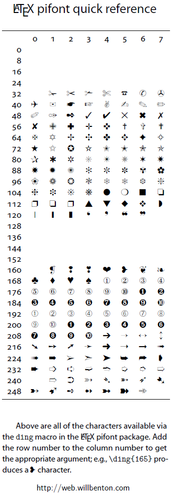

# Ejemplo de creación de marcas

```tex
\documentclass{article}
\usepackage{amssymb}% http://ctan.org/pkg/amssymb
\usepackage{pifont}% http://ctan.org/pkg/pifont
\newcommand{\cmark}{\ding{51}}%
\newcommand{\xmark}{\ding{55}}%
\begin{document}
\verb|\checkmark|: \checkmark \par
\verb|\cmark|: \cmark \par
\verb|\xmark|: \xmark
\end{document}
```

Teniendo encuenta la siguiente imagen:



