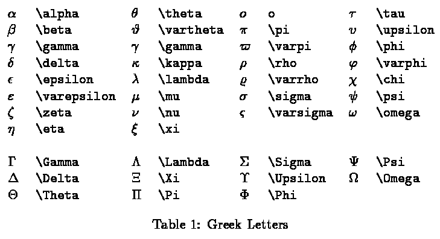
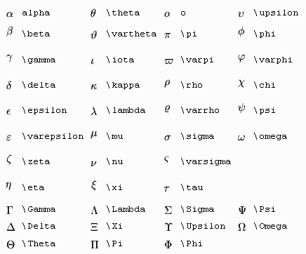
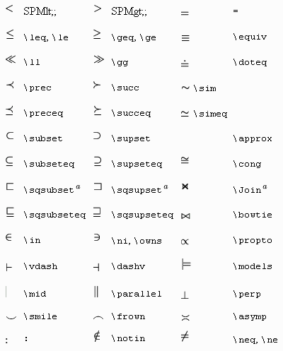
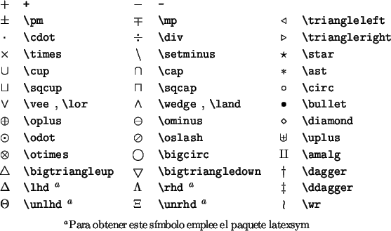
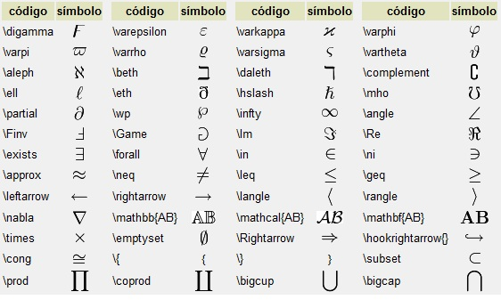
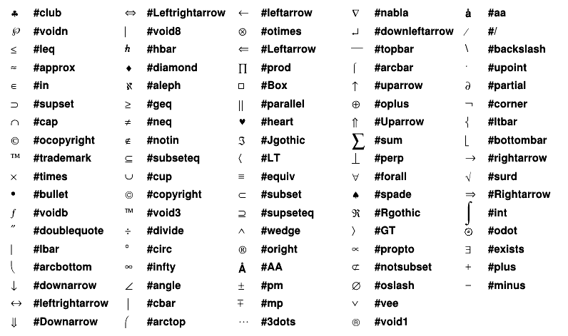
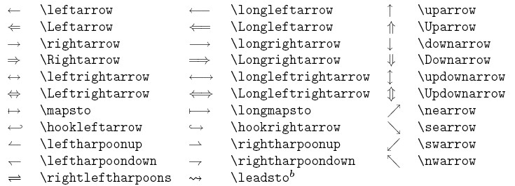

# Símbolos

## Símbolos griegos 1

{: style="width:100%; margin-left: auto; margin-right: auto; display: block"}

## Símbolos griegos 2

{: style="width:100%; margin-left: auto; margin-right: auto; display: block"}

## Símbolos inecuaciones y conjuntos

{: style="width:100%; margin-left: auto; margin-right: auto; display: block"}

## Operadores 1

{: style="width:100%; margin-left: auto; margin-right: auto; display: block"}

## Operadores 2

{: style="width:100%; margin-left: auto; margin-right: auto; display: block"}

## Collage de operadores

{: style="width:100%; margin-left: auto; margin-right: auto; display: block"}

## Flechas

{: style="width:100%; margin-left: auto; margin-right: auto; display: block"}

## Referencias

[Derivadas, integrales, limites, sumas](https://math-linux.com/latex-26/faq/latex-faq/article/latex-derivatives-limits-sums-products-and-integrals)
