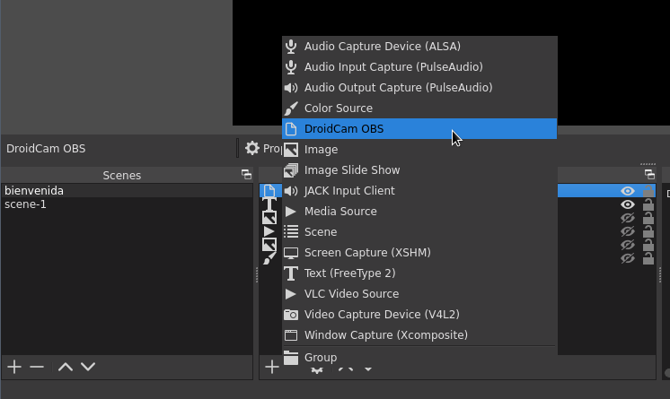

# Droidcam OBS

[Información oficial](http://dev47apps.com/obs/)

!!! Info "Debes tener instalado obs-studio"
    


Intstalar la aplicación en tu dispositivo celular a través de playstore

```bash
mkdir ~/gitPackages/dev47apps/
cd ~/gitPackages/dev47apps/ 
```

De la página oficial descarga la versión para linux y descomprime en el directorio
que creaste

Ejecuta el siguiente comando

```bash
sh install.sh
```

Quedará instalado el plugin en obs

{: style="width:100%; margin-left: auto; margin-right: auto; display: block"}


