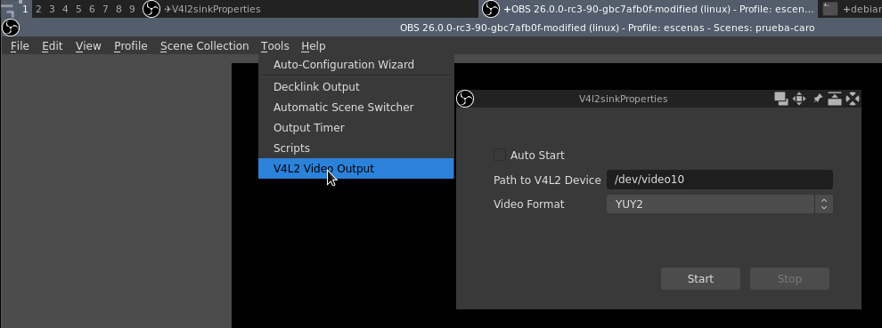

# Stream en virtual cam

## Instalación de camara virtual

```bash
cd ~/gitPackages/
git clone https://github.com/umlaeute/v4l2loopback.git
make && sudo make install
sudo depmod -a
```

### Comandos útiles

* `v4l2-ctl --list-devices`
* `v4l2-ctl --list-formats` listar formatos soportados por el dispositivo
* `xrandr | grep ' connected'`
* `lsmod | grep v4l2loopback` buscar el módulo del kernel
* `sudo modprobe v4l2loopback exclusive_caps=1` requiere documentación
* `rm -rf ~/.config/Webcamoid/` si tiene conflictos con esos dispositivos

## Instalación de plugin obs v4l2sink

```bash
sudo apt install qtbase5-dev
cd ~/gitPackages/
```

Verifica que en este nivel de directorio tengas la fuentas de obs-studio;
en caso de no tenerlas ejecuta el siguiente comando:

```bash
git clone --recursive https://github.com/obsproject/obs-studio.git
```

Clona el proyecto para compilar el plugin de obs

```bash
git clone https://github.com/CatxFish/obs-v4l2sink.git
cd obs-v4l2sink
mkdir build && cd build
cmake -DLIBOBS_INCLUDE_DIR="../../obs-studio/libobs" -DCMAKE_INSTALL_PREFIX=/usr ..
make -j4
sudo make install

```

## Ejemplo de uso

Verifica que no existe un dispositivo de video **video10**, ejemplo:

```bash
ls /dev/video*
```

Crea el dispositivo de video **video10** por donde realizarás el stream:

```bash
sudo modprobe v4l2loopback devices=1 video_nr=10 card_label="OBS Cam" exclusive_caps=1
```

Inicia el stream con el plugin de obs con un formato que sea soportado:

{: style="width:100%; margin-left: auto; margin-right: auto; display: block"}


En meet, zoom o similar podrás encontrar la cámara con el nombre de **OBS Cam**.
en aplicaciones como VLC la podras encontrar como dispositivo de captura
**/dev/video10**

## Referencias

### V4l2loopback

[repositorio v4l2loopback](https://github.com/umlaeute/v4l2loopback)

[umlaeute wiki](https://github.com/umlaeute/v4l2loopback/wiki)

[video youtube](https://www.youtube.com/watch?v=6AZRiW3hHrw)

[ejemplo de captura con ffmpeg](https://stackoverflow.com/questions/36986037/screen-capture-recorder-to-record-2nd-monitor-ffmpeg-win-7)

[grabando con x11 y ffmpeg](https://www.reddit.com/r/linux/comments/8n3ylp/screen_recording_in_x11_with_ffmpeg/)

[grabando con ffmpeg](https://vlab.ncep.noaa.gov/web/oclo/internal-default-jobsheet-display-page/-/asset_publisher/xLjC16El6sCv/content/recording-your-desktop-with-ffmpeg)

[como capturar screen por comandos](https://unix.stackexchange.com/questions/73622/how-to-get-near-perfect-screen-recording-quality)

[captura con ffmpeg](https://trac.ffmpeg.org/wiki/Capture/Desktop)

### Obs plugin v4l2sink

[youtube: ejemplo de uso](https://www.youtube.com/watch?v=Eca509IDLdM)

[ejemplo de uso del plugin en obs](https://github.com/umlaeute/v4l2loopback/wiki/OBS-Studio)

[github plugin v4l2sink](https://github.com/CatxFish/obs-v4l2sink)

[wiki de obs](https://github.com/obsproject/obs-studio/wiki/Install-Instructions#debian-based-build-directions)

