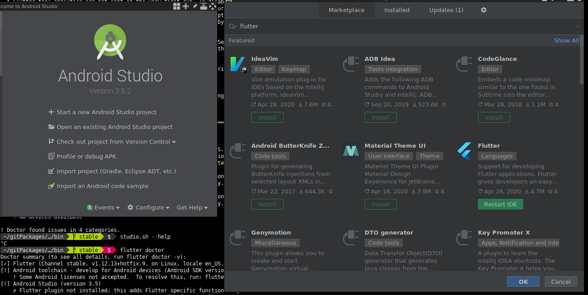

# Flutter Configuración

## Fuentes

[Herramientas para dar soporte a flutter en VIM](https://dev.to/tavanarad/vim-as-a-flutter-ide-4p16)

[Repositorio flutter-coc para VIM](https://github.com/iamcco/coc-flutter)

[Instalación de flutter enGNU/Linux](https://flutter-es.io/docs/get-started/install/linux)

[Dar soporte de aplicación web a una aplicación móvil creada con flutter](https://flutter.dev/docs/get-started/web)

[Crear proyectos flutter para android e ios desde terminal](https://medium.com/codespace69/how-to-create-a-new-project-in-flutter-8fcfe01e8800)

## Instalación de Flutter

```bash
sudo apt install libglu1-mesa
```
En [flutter-releases](https://flutter-es.io/docs/development/tools/sdk/releases?tab=linux)
seleccionar la versión a instalar

Descargar flutter en el siguiente directorio

```bash
mkdir ~/gitPackages && cd ~/gitPackages/
wget -O flutter.tar.xz "url"
tar xvf flutter.tar.xz
```

Finalmente exportar el PATH al bashrc

Ejemplo:

```bash
# Flutter PATH 
export PATH=$PATH:$HOME/gitPackages/flutter/bin
```

Instalar Android Studio y agregar los plugins requeridos

{: style="width:100%; margin-left: auto; margin-right: auto; display: block"}

Ejecutar `flutter doctor`

¿Problemas con licencias? `flutter doctor --android-licenses`

Finalmente instalar algunos precompilados para flutter `flutter precache`

##  Flutter en VIM 

Agregar en el *vimrc* lo siguiente

```bash
"Flutter support for vim
Plug 'dart-lang/dart-vim-plugin'
Plug 'natebosch/vim-lsc'
Plug 'natebosch/vim-lsc-dart'
Plug 'neoclide/coc.nvim', {'branch': 'release'}
```

**Ejecutar**: `:PlugInstall`

**Ejecutar**: `:CocInstall coc-flutter`


