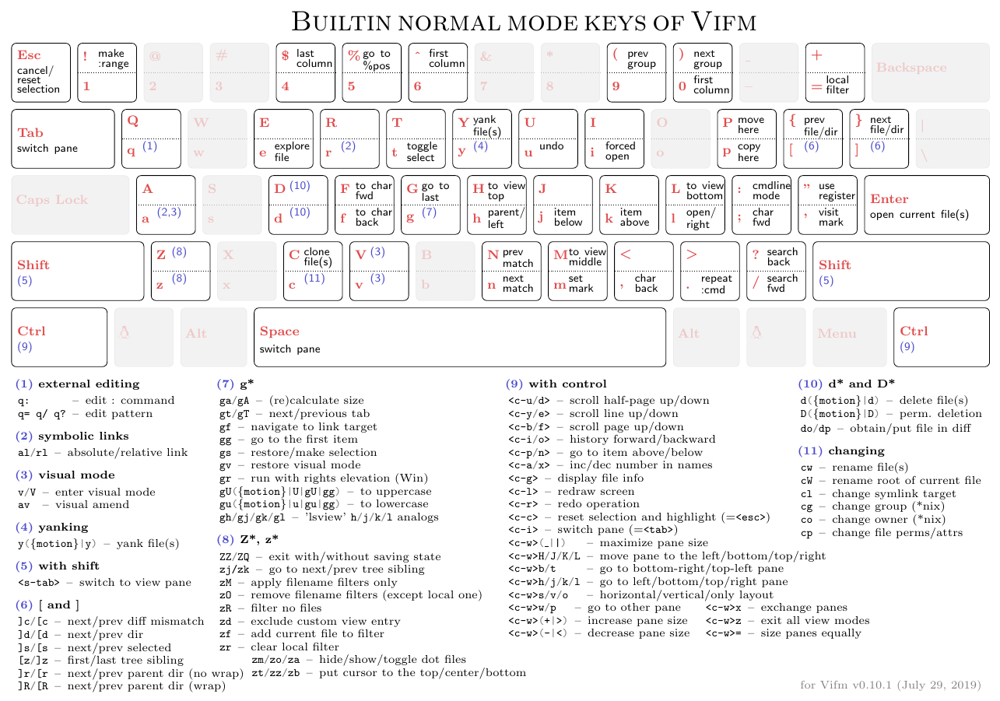

# vifm

File Manager basado en ncurses y vim

## Fuentes

[Cheatsheet](https://vifm.info/cheatsheets.shtml)

[vimdocs](https://vifm.info/vimdoc.shtml)

[Vim manual](https://vifm.info/manual.shtml)

## Comandos básicos

Commands | Descriptions
--- | ---
<kbd>c</kbd> <kbd>w</kbd> | Renombrar un archivo

view, sort

## Cheatsheet

{: style="width:100%; margin-left: auto; margin-right: auto; display: block"}

